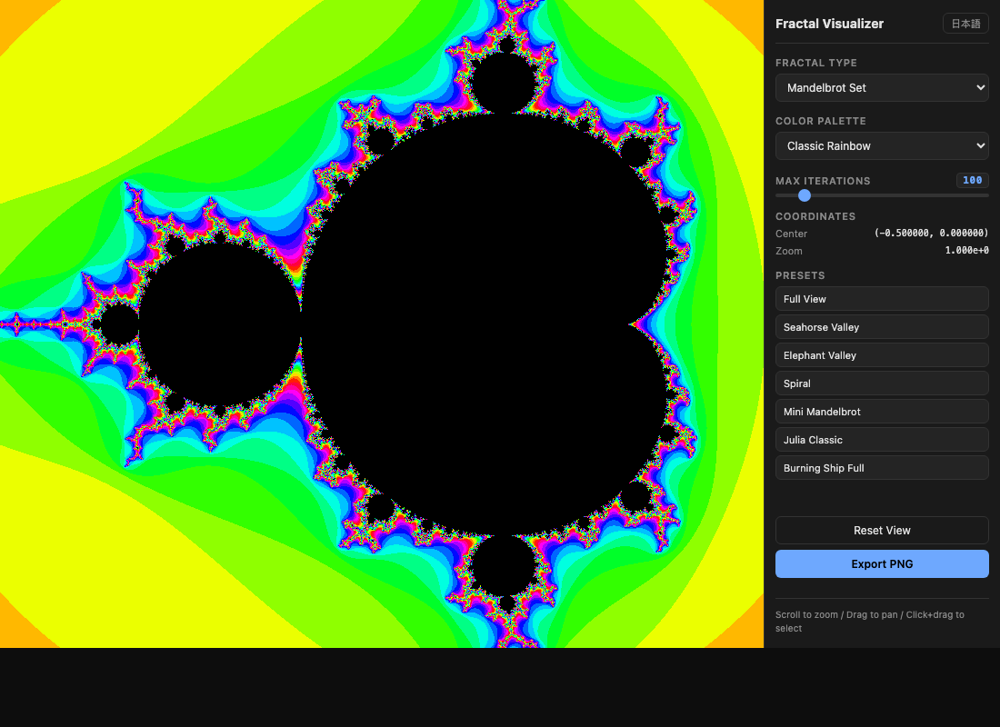

# Fractals — フラクタル可視化

Interactive fractal visualizer for **Mandelbrot**, **Julia**, and **Burning Ship** sets.
Vanilla JS + Canvas. Zero dependencies. No build step.

**Live demo:** https://sen.ltd/portfolio/fractals/



## Features

- **3 fractal types** — Mandelbrot, Julia (configurable c), Burning Ship
- **Interactive zoom** — scroll wheel, click+drag selection rectangle
- **Pan** — drag to move the viewport
- **5 color palettes** — Classic Rainbow, Fire, Cool Blue, Grayscale, Psychedelic
- **Max iterations slider** — 50 to 500
- **Preset views** — Seahorse Valley, Elephant Valley, Spiral, Mini Mandelbrot, classic Julia
- **Progressive rendering** — low-res preview first, then full resolution
- **Export PNG** — save the current view
- **Japanese / English UI** — toggle with one click
- **Dark theme**

## Usage

```bash
# Serve locally
python3 -m http.server 8080
# then open http://localhost:8080
```

Or just open `index.html` directly (ES modules require a server for relative imports).

## Controls

| Action | Input |
|---|---|
| Zoom in/out | Scroll wheel |
| Pan | Left-click drag |
| Zoom to region | Shift + drag to draw selection |
| Reset view | Reset View button |
| Export | Export PNG button |

## Tests

```bash
npm test
```

Requires Node.js 18+. Uses the built-in `node:test` runner — no external dependencies.

## Project structure

```
fractals/
├── index.html          # Entry point
├── style.css           # Dark-theme UI
├── src/
│   ├── main.js         # DOM, events, rendering pipeline
│   ├── fractals.js     # Pure math (iteration counts)
│   ├── palette.js      # Color palettes + RGBA conversion
│   └── i18n.js         # ja/en translations
├── tests/
│   └── fractals.test.js
└── assets/
    └── screenshot.png
```

## License

MIT — Copyright (c) 2026 SEN LLC (SEN 合同会社)
